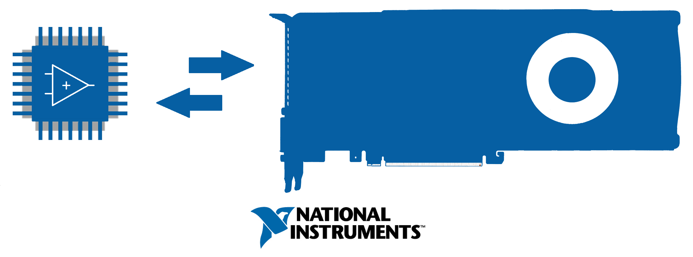
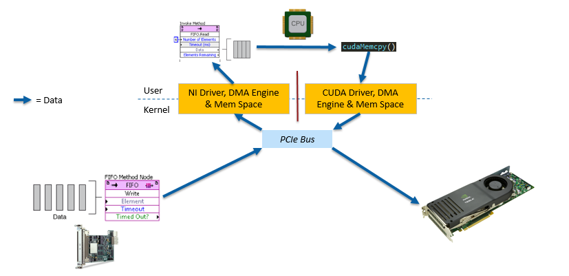
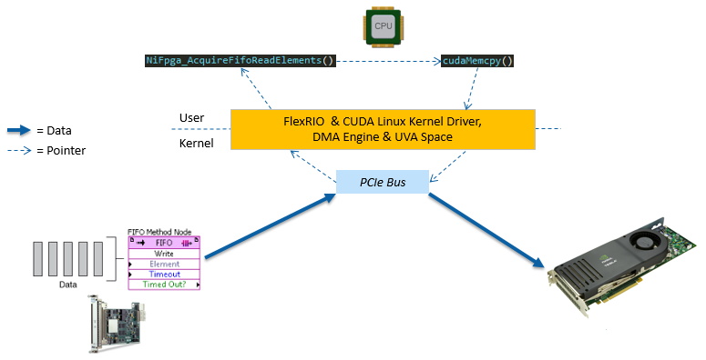
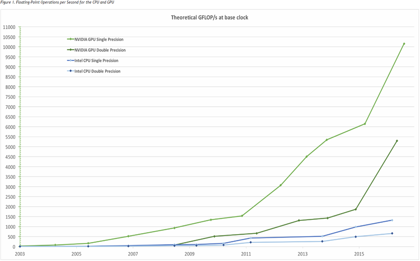
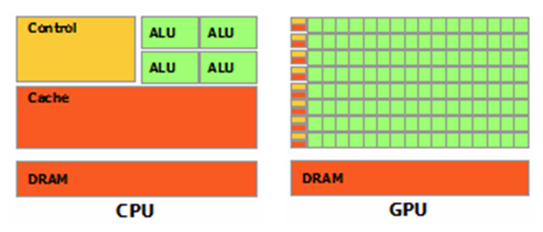

<p align="center">
  <h1 align="center">FlexRIO Peer-to-Peer GPU</h1>
    
</p>

NI FlexRIO Driver and example code for implementing peer-to-peer (P2P) data streams between a National Instruments FlexRIO device and a NVIDIA GPU using a zero-copy, bidirectional, DMA communication path using [NVIDIA GPUDirect™](https://developer.nvidia.com/gpudirect).

## Contents

* [Getting Started](#Getting-Started)

## About

FPGAs and GPUs are becoming the norm in bleeding-edge performance applications. Traditionally, it has been fairly hard to combine both platforms within the same system; usually, to share data between an FPGA and GPU, one would need to develop a user-space application to bridge the gap:



However, to achieve this, many memory copies need to be made, leading to high latencies, increased CPU usage and drastically eating into host controller memory bandwidth and space.

Now, with a new Linux kernel driver, NI FlexRIO FPGA modules can do true DMA communication, peer-to-peer, with a NVIDIA Tesla/Quadro GPU:



This opens the door to applications needing higher memory bandwidth, increased application performance or other benefits of direct P2P communication between an open-FPGA and CUDA-enabled GPU.

### Why GPUs?

FPGAs are hugely powerful and have some key benefits:
* Low latency and response times
* Specialized algorithmic design that can outperform a CPU by orders of magnitude
* Designs can be optimized for power or speed
* Rapid prototyping with ability of re-design compared to dedicated silicon/ASICs

However, FPGAs are not great for every application and there are some known drawbacks:
* Design/algorithm limited to available resources on FPGA
* Limited matrix/array operations
* Floating point performance
* Relatively long development time
* Relatively limited memory _(Exceptions are devices like FlexRIO with on-board DRAM)_

Traditionally, the drawbacks of FPGAs and ASICs were only able to be solved by a host computer’s application code targeting a bus-connected CPU that can do these more advanced series of algorithms within a set of instructions defined by a user program. With this, a CPU is generally measured in the amount of operations/instructions it can chug through within a given unit of time (in industry usually this is measure via core clock speed) so for operations on large data sets, the performance is directly related to how fast we can serially crunch through the data set.



However, as the above shows, there is a large discrepancy in floating-point compute capability between the CPU and the GPU; this is because GPUs are specialized for compute-intensive, highly parallel computation - exactly what graphics rendering is about and how GPUs got their start- and therefore designed such that more transistors are devoted to data processing rather than data caching and flow control.



This makes GPUs as an advantageous platform for “data-parallel computations” in which a highly arithmetic algorithm can be executed on many, many data elements in parallel as opposed to doing many memory based operations that require sophisticated flow control silicon (this is the strong suit of CPUs where latency and optimization of instructions are key). We can leverage the advantages of the GPU HW platform with CUDA programs.

### What's CUDA?

> "…a general purpose parallel computing platform and programming model that leverages the parallel compute engine in NVIDIA GPUs to solve many complex computational problems in a more efficient way than on a CPU”- from NVIDIA CUDA C Programming Guide

CUDA C extends the C language by allowing the programmer to define C functions, called kernels, that, when called, are executed N times in parallel by N different CUDA threads, as opposed to only once with serial execution like regular C functions. There is also support for languages like Fortran and OpenCL.

For more information on the CUDA language and best practices, see the [NVIDIA CUDA C Programming Guide](https://docs.nvidia.com/cuda/cuda-c-programming-guide/).

## Development Flow

Using the included examples as reference, the typical development flow is:
1. __Develop the FPGA personality in LabVIEW FPGA:__ There is nothing special needed on the LabVIEW Development side so FPGA VIs are developed as normal in any Windows environment. The DMA FIFOs used for P2P communication are regular Host-to-Target and Target-to-Host DMA FIFO types in LabVIEW FPGA. Thus the datatypes and operation on the FPGA side are the same as traditional usage.
2. __Generate Header File for Bitfile Using FPGA C API Generator:__ Once the FPGA design is complete, use the [FPGA Interface C API 16.0](http://www.ni.com/download/fpga-interface-c-api-16.0/6274/en/) to generate the needed header file for the FPGA C API.
3. __Bring Bitfile and Header into Linux Development Machine and Develop C/CUDA Host/GPU Code:__ From here, the host code development uses the familiar NI FPGA C API and the programmer is free to develop any addon CUDA functionality and kernel functions.
4. __Build and Run in Linux System__

## Getting Started & Installation

### Hardware Prerequisites

* NI FlexRIO FPGA Module ([NI PXIe-7976](http://www.ni.com/en-us/support/model.pxie-7976.html) suggested)
* NI PXIe Chassis and MXIe Kit ([NI PXIe1085](http://www.ni.com/en-us/support/model.pxie-1085.html) and [NI PXIe-8381](http://www.ni.com/en-us/shop/select/pxi-remote-control-module) suggested)
* NVIDIA Tesla™ or Quadro™ GPU (Kepler-class or later) 

_Note on Desktop/Chipset Selection: Both FlexRIO and GPU should share the same PCIe root complex and ideally should only be seperated by PCIe switches, however some chipsets, and physical slot placements, cause the PCIe path to traverse across a CPU/IOH or QPI/HT link which can cause serious performance degredation or even failure of DMA communication. For more information, see [here](http://docs.nvidia.com/cuda/gpudirect-rdma/index.html#supported-systems)_

### Software Prerequisites

Currently, NVIDIA's GPUDirect functionality is only supported on Linux Operating Systems. Furthermore, FlexRIO Driver Support for Linux requires one of the following distributions:

* Red Hat Enterprise Linux 6.x x86_64
* Red Hat Enterprise Linux 7.x x86_64
* Scientific Linux 6.x x86_64
* openSUSE 13.2 x86_64
* openSUSE Leap 42.1 x86_64
* CentOS 7 x86_64

*Note: FlexRIO no longer officially supports x86 systems. See NI_FlexRIO-16.0.0_P2P_GPU_Driver/README.txt for more information.*

This example was mainly tested and developed with the most recent version of [CentOS 7](https://www.centos.org/download/). At a minimum, the following packages should be installed (CentOS instructions shown as an example):
```bash
$ yum -y groupinstall "Development Tools"
$ yum -y install install avahi gcc kernel-devel-$(uname -r) libstdc++.i686
```

(Optional) Install [gnuplot](http://www.gnuplot.info/docs_5.0/gnuplot.pdf) for graphing functionality with `GPU_FFT` example.

To develop a bitfile from LabVIEW FPGA and have C API support, the following should be installed on a Windows development machine:
* [LabVIEW 2016 (32-bit)](http://www.ni.com/download/labview-development-system-2016/6046/en/)
* [LabVIEW 2016 FPGA Module](http://www.ni.com/download/labview-fpga-module-2016/6223/en/)
* [FPGA Interface C API 16.0](http://www.ni.com/download/fpga-interface-c-api-16.0/6274/en/)
* [FlexRIO 16.1](http://www.ni.com/download/ni-flexrio-16.1/6484/en/) 

### Installation

1. Download FlexRIO_P2P_GPU-0.1.tar.gz
2. Unzip tarball and install FlexRIO driver
```bash
$ tar xzf FlexRIO_P2P_GPU-0.1.tar.gz
$ cd FlexRIO_P2P_GPU-0.1/NI_FlexRIO-16.0.0_P2P_GPU_Driver/
$ sudo sh INSTALL
```
3. Install latest [CUDA Driver and Toolkit](https://developer.nvidia.com/cuda-downloads)
        + Note you might need to disable Nouveau drivers and after installation you will need to update your path to point to the `nvcc` compiler. For more information, see the [NVIDIA CUDA Installation Guide for Linux](http://docs.nvidia.com/cuda/cuda-installation-guide-linux/#axzz4mekl7Exi)
4. Verify your system can see your HW targets; run `lsni64` to view all connected NI devices (and the associated RIO handle of the FlexRIO) and compile then run the CUDA example `deviceQuery` to view connected CUDA GPU devices.
5. To build the examples, enter the example's directory and run `make`
6. The examples are meant to pass parameters such as the FPGA bitfile, bitfile signature and RIO handle of the intended FlexRIO target. Examples of running the `throughput_test` example:
```bash
$ ./throughput_test -b NiFpga_FPGA_main.lvbitx \
    -s "3D8FA985BF4824A9C2343697C9135C49" -r "RIO0"
```

...and for the `GPU_FFT` example:

```bash
$ ./GPU_FFT -la -b ./NiFpga_FPGA_Main.lvbitx \
-s "DAA4B54616BF18D27170CFDD9178EF17" -r "RIO0" > SimSignal.dat
$ gnuplot gnuplot_conf
```

The last line runs gnuplot against the data file `SimSignal.dat` and outputs a PNG file of the power spectrum `spectrum.png`.

## Aditional References

* [NI FPGA Interface C API Help](http://zone.ni.com/reference/en-XX/help/372928G-01/)
* [Developing a Linux Kernel Module using GPUDirect RDMA](http://docs.nvidia.com/cuda/gpudirect-rdma/index.html)
* [NVIDIA CUDA C Programming Guide](https://docs.nvidia.com/cuda/cuda-c-programming-guide/)
* [NVIDIA CUDA Zone](https://developer.nvidia.com/cuda-zone)
